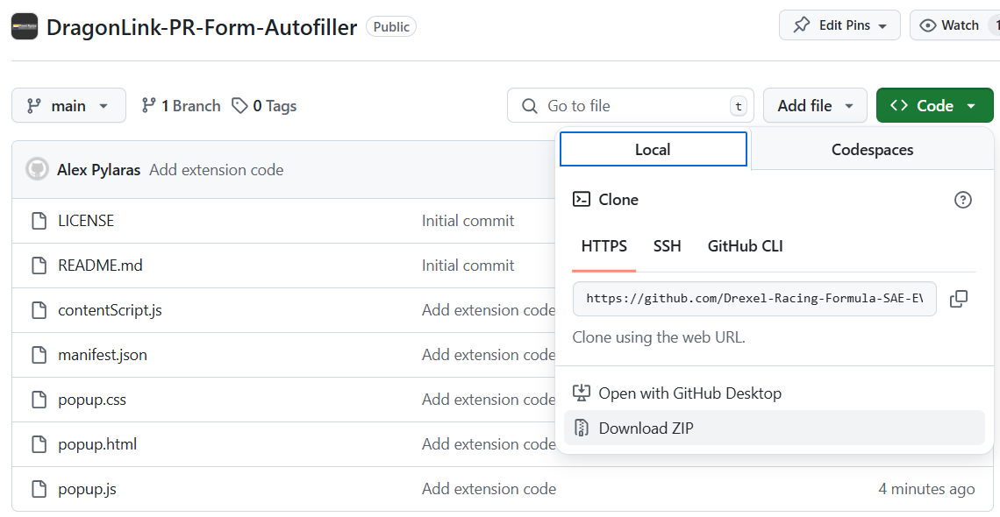
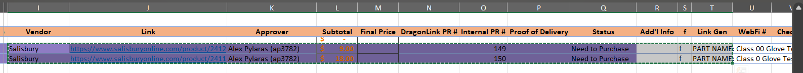

# DragonLink-PR-Form-Autofiller

This is a Chrome extension to automatically fill out the Purchase Request form on DragonLink based on some copied data from our internal Purchase Request Spreadsheet (PRS)

## Usage

### First-time Setup
1. Download a .zip of the repository

2. Put the .zip in a safe place (ex. not your "Downloads" folder)
3. Unizp the .zip
4. Open Chrome and go to chrome://extensions/
5. Click "Load unpacked" in the top left and select the unzipped folder
6. Click the "Extensions" button (puzzle piece) in the top right of your screen
7. Click the pin icon next to the extension
8. Click the extension ("D" symbol) in the top right
9. Fill out your position, your phone number, and your Drexel email
10. Click the "Save" button

### Creating a new PR
1. Go to https://dragonlink.drexel.edu/actionCenter/organization/drexel-electric-racing/Finance/CreatePurchaseRequest
2. Make sure the items for this PR have been added to the PRS
3. Generate the links with the f functions
4. Copy from the "Vendor" column to the "Link Gen" column for all the relevant rows

5. Click on the extension ("D" symbol) in the top right of Chrome
6. Answer the "Is this PR for food and/or for an event?" question
7. Paste what you copied from the PRS into the "Paste cells from PR Spreadsheet" text box
8. Click the "Fill" button
